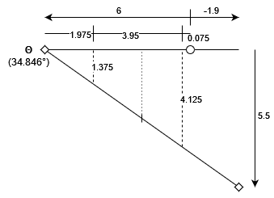

## Calculating magic numbers

First, we start with the leading strand backbone, arbitrarily offset by (**6**, 0) units from the origin. Each row was then incrementally rotated **34.3** degrees for 10.5 basepair per full 360 degree turn.

The lagging strand backbone was then constructed, first simply set as offset by (-6, 0) units from the origin, but lagging by 3 rows. The true backbone location was then eyeballed to be offset by (**-1.9**, **5.5**) units from the origin.

The nucleotide angle (from leading strand backbone position to lagging strand backbone position) was then calculated to be **34.846** degrees:

$$\arctan{\frac{5.5}{6 + 1.9}} = 34.846^{\circ}$$

The total space between the two backbones was calculated to be 9.626:

$$(6 + 1.9)^2 + (5.5)^2 = (9.626)^2$$

The length of the cylinder representing each nucleotide is thus 9.626 / 2 = **4.813**.

The pivot point of each cylinder, however, is halfway down its length. To find the location of the pivot points relative to the origin, the offset along the x-axis was first calculated. Dividing the total length along the x-axis by 4 yields 1.975. Using, this number, the relative offset from along the x-axis from the origin was calculated to be -1.9 + 1.975 = **0.075** for the lagging strand, and 0.075 + (2 * 1.975) = **4.125** for the leading strand.

Using the relative x-axis offsets relative to the leading strand backbone location, we calculate the offset for the other axis. First, for the leading strand:

$$\tan{(34.846)} \cdot 1.975 = 1.375$$

Then, for the lagging strand:

$$\tan{(34.846)} \cdot (1.975 + 3.95) = 4.125$$

Diagram illustrating the above:

